# Design Document: StreamTide - NYC Taxi Big Data Analytics System

## 1. System Overview

StreamTide is a real-time analytics system for NYC taxi demand modeling and dynamic fare optimization. The system processes historical taxi trip records from years 2020 and 2025 using streaming algorithms (Reservoir Sampling and Bloom Filters) to detect demand surges, estimate trip distributions, and provide insights into fare dynamics.

**Data Source:** NYC Taxi & Limousine Commission (TLC) - 2020 & 2025 records in Parquet format (~200M+ records)
**Cloud Platform:** AWS (Amazon Web Services)

## 2. System Architecture

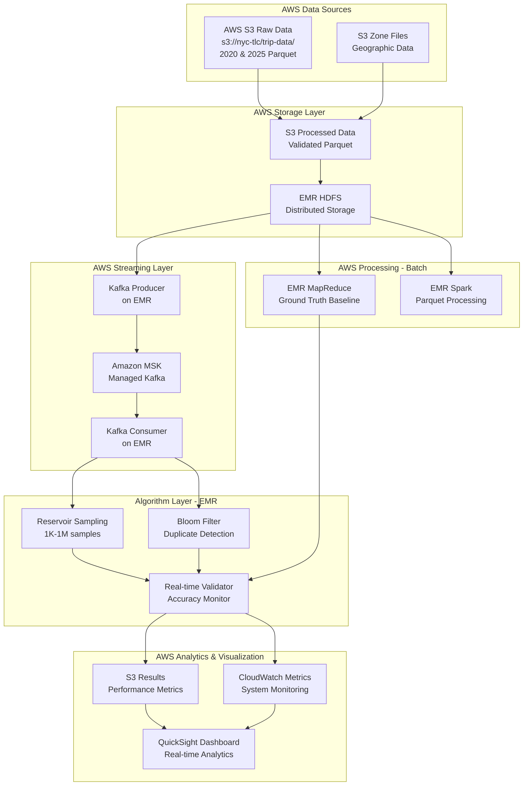

## 3. Data Pipeline Design

### 3.1 Data Flow Stages

| Stage | Component | Input | Output | Purpose |
|-------|-----------|-------|--------|---------|
| **Ingestion** | AWS CLI / SDK | S3 nyc-tlc bucket (2020, 2025) | Raw Parquet files | Acquire ~200M records |
| **Validation** | EMR Spark job | Raw Parquet from S3 | Validated dataset | Schema check, integrity |
| **Storage** | S3 + EMR HDFS | Validated data | S3 processed bucket | Fault-tolerant storage |
| **Baseline** | EMR MapReduce | S3/HDFS data | Ground truth metrics | Statistical baselines |
| **Streaming** | MSK producer on EMR | S3/HDFS data | Kafka topics | Real-time simulation |
| **Processing** | EMR Spark + Algorithms | MSK stream | Analytics results | Demand/fare analysis |
| **Visualization** | QuickSight + CloudWatch | S3 results, CW metrics | Interactive dashboards | Monitoring & insights |

### 3.2 Data Schema Structure

| Field Category | Fields | Data Type | Purpose |
|----------------|--------|-----------|---------|
| **Trip Identity** | trip_id, vendor_id | String | Unique identification |
| **Temporal** | pickup_datetime, dropoff_datetime | Timestamp | Time-series analysis |
| **Spatial** | pickup_location_id, dropoff_location_id | Integer | Zone-based demand |
| **Fare** | fare_amount, tip_amount, total_amount | Decimal | Pricing analysis |
| **Metrics** | trip_distance, passenger_count | Float/Integer | Trip characteristics |

## 4. AWS Infrastructure Design

### 4.1 AWS EMR Cluster Architecture

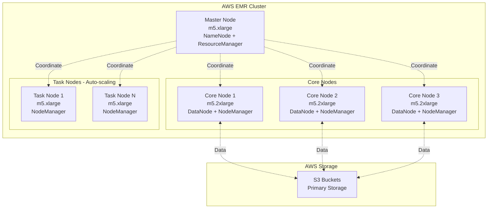

**EMR Cluster Specifications:**

| Parameter | Configuration | Rationale |
|-----------|--------------|-----------|
| **Master Node** | 1x m5.xlarge (4 vCPU, 16 GB) | Cluster coordination, lightweight |
| **Core Nodes** | 3x m5.2xlarge (8 vCPU, 32 GB) | HDFS storage + processing |
| **Task Nodes** | 2-10x m5.xlarge (auto-scale) | Flexible compute for peak loads |
| **EMR Version** | 6.10+ or 7.x | Latest Spark 3.x, Kafka support |
| **HDFS Replication** | 3x | Fault tolerance within EMR |
| **S3 Storage** | 2-5 TB (2020+2025 data) | Primary durable storage |

### 4.2 EMR Spark Configuration

| Component | Configuration | Purpose |
|-----------|--------------|---------|
| **Execution Mode** | Cluster mode on EMR | Distributed processing |
| **Executor Memory** | 8-12 GB per executor | Handle 200M+ record processing |
| **Executor Cores** | 4 cores per executor | Parallel task execution |
| **Driver Memory** | 8 GB | Manage job coordination |
| **Partitioning** | 200-400 partitions | Optimize parallelism |
| **Optimizer** | Catalyst + Tungsten | Query optimization, code generation |
| **S3 Integration** | S3A connector with committers | Efficient S3 read/write |

### 4.3 AWS S3 Bucket Structure

| Bucket/Prefix | Purpose | Data Format | Lifecycle |
|---------------|---------|-------------|-----------|
| **s3://nyc-taxi-raw/** | Raw TLC data download | Parquet (2020, 2025) | Retain 90 days |
| **s3://nyc-taxi-processed/** | Validated, cleaned data | Parquet (partitioned) | Retain indefinitely |
| **s3://nyc-taxi-results/** | Ground truth, algorithm output | Parquet, JSON | Retain 180 days |
| **s3://nyc-taxi-logs/** | EMR logs, application logs | Text, JSON | Retain 30 days |
| **s3://nyc-taxi-checkpoints/** | Spark streaming checkpoints | Binary | Retain 7 days |

## 5. AWS Streaming Architecture Design

### 5.1 Amazon MSK (Managed Streaming for Kafka) Setup

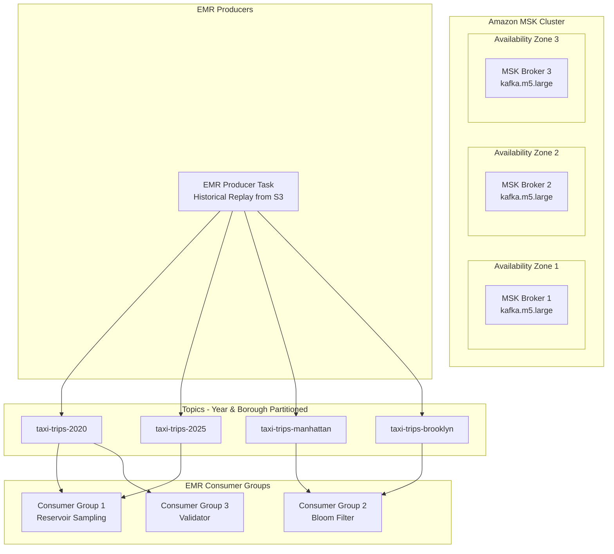

**Amazon MSK Configuration:**

| Parameter | Value | Rationale |
|-----------|-------|-----------|
| **Broker Type** | kafka.m5.large (2 vCPU, 8 GB) | Cost-effective for 200M records |
| **Brokers** | 3 brokers (multi-AZ) | High availability, fault tolerance |
| **Partitions** | 12 per topic | Parallel consumption, scalability |
| **Replication** | 3x (across AZs) | Data durability |
| **Retention** | 7 days | Allow replay for validation |
| **Compression** | Snappy | Reduce network/storage overhead |
| **Authentication** | IAM + TLS | Secure access from EMR |

### 5.2 AWS Stream Processing Flow

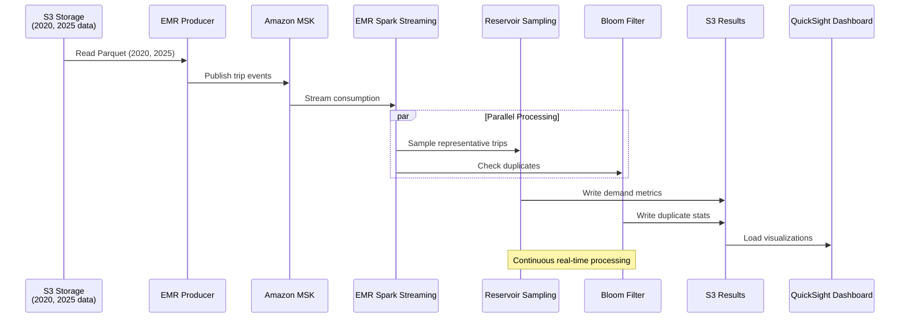

### 5.3 AWS Data Year Filtering Strategy

| Year | Records (Approx) | S3 Prefix Pattern | Use Case |
|------|------------------|-------------------|----------|
| **2020** | ~100M trips | s3://nyc-tlc/trip-data/yellow_tripdata_2020-*.parquet | Pre-pandemic + pandemic impact |
| **2025** | ~100M trips | s3://nyc-tlc/trip-data/yellow_tripdata_2025-*.parquet | Current year patterns |
| **Combined** | ~200M trips | Both prefixes | Temporal comparison analysis |

## 6. Streaming Algorithms Implementation Design

### 6.1 Reservoir Sampling Design

**Purpose:** Memory-efficient random sampling to maintain representative subset of streaming taxi trips

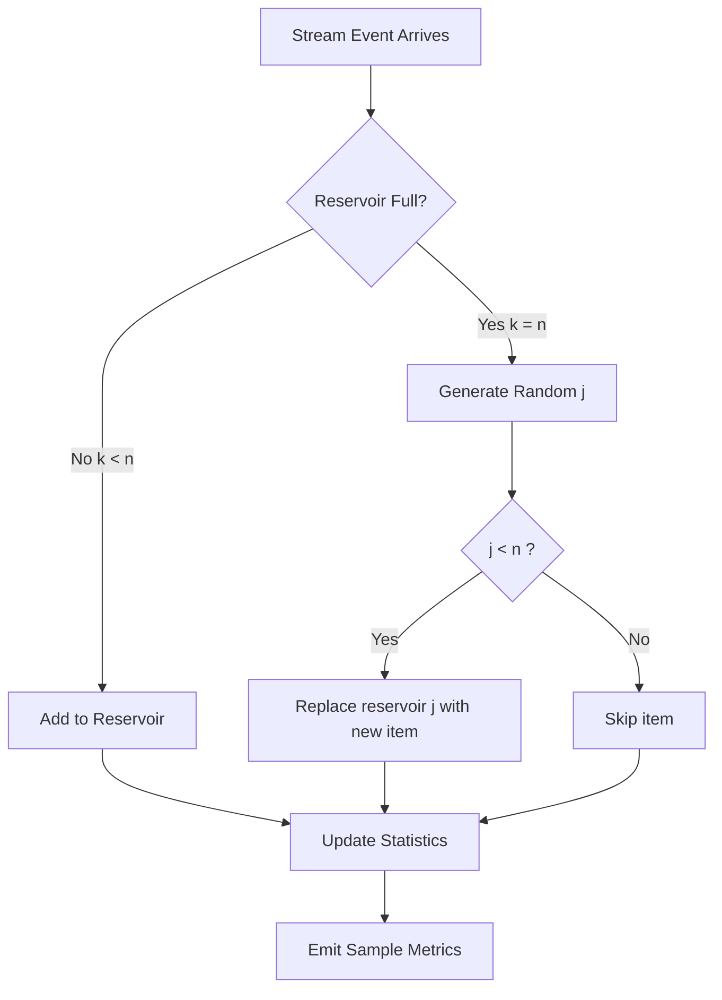

**Configuration Matrix:**

| Sample Size | Memory Usage | Accuracy | Use Case |
|-------------|--------------|----------|----------|
| 1,000 | ~100 KB | ±5% | Quick prototyping |
| 10,000 | ~1 MB | ±2% | Development testing |
| 100,000 | ~10 MB | ±0.5% | Production monitoring |
| 1,000,000 | ~100 MB | ±0.1% | High-precision analysis |

**Stratification Strategy:**

| Dimension | Strata | Purpose |
|-----------|--------|---------|
| **Temporal** | Hourly buckets (0-23) | Capture peak/off-peak patterns |
| **Spatial** | Borough-based (5 zones) | Geographic demand distribution |
| **Fare Tiers** | Low/Medium/High | Price sensitivity analysis |

### 6.2 Bloom Filter Design

**Purpose:** Fast duplicate detection across billions of trip records with minimal memory

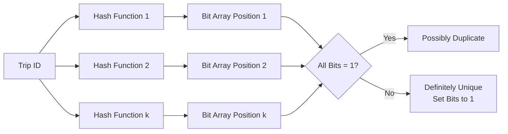

**Configuration Parameters:**

| Bit Array Size | Hash Functions | Expected Items | False Positive Rate | Memory |
|----------------|----------------|----------------|---------------------|--------|
| 1 MB | 3 | 100K | ~1% | 1 MB |
| 10 MB | 5 | 1M | ~0.1% | 10 MB |
| 100 MB | 7 | 10M | ~0.01% | 100 MB |
| 1 GB | 10 | 100M | ~0.001% | 1 GB |

**Hash Function Strategy:**

| Hash Type | Characteristics | Use Case |
|-----------|----------------|----------|
| **MurmurHash3** | Fast, good distribution | Primary hashing |
| **CityHash** | Optimized for strings | Trip ID hashing |
| **SHA-256** | High quality, slower | Critical deduplication |

### 6.3 Flajolet-Martin Algorithm Design

**Purpose:** Estimate distinct counts (unique passengers, zones, drivers) in streaming data with minimal memory

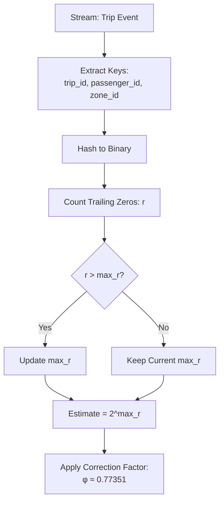

**Multi-hash Configuration:**

| Metric | Hash Groups | Buckets per Group | Memory | Accuracy |
|--------|-------------|-------------------|---------|----------|
| **Distinct Zones** | 16 groups | 8 hash functions | ~2 KB | ±15% (median estimate) |
| **Distinct Passengers** | 32 groups | 16 hash functions | ~4 KB | ±10% |
| **Distinct Trip IDs** | 64 groups | 32 hash functions | ~8 KB | ±8% |

**Application to NYC Taxi Data:**

| Use Case | FM Application | Benefit |
|----------|----------------|---------|
| **Unique Zone Coverage** | Estimate distinct pickup/dropoff locations per hour | Understand service area without storing all zones |
| **Passenger Diversity** | Count unique passenger patterns in real-time | Memory-efficient diversity tracking |
| **Driver Activity** | Estimate number of active drivers per time window | Fleet management insights |

### 6.4 DGIM Algorithm Design

**Purpose:** Count number of trips in sliding time windows with logarithmic memory

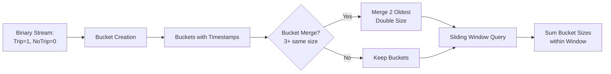

**Window Configuration:**

| Window Size | Buckets Maintained | Memory | Error Bound |
|-------------|-------------------|---------|-------------|
| **1 Hour (3600s)** | O(log² 3600) ≈ 144 | ~2 KB | ≤ 50% |
| **24 Hours** | O(log² 86400) ≈ 340 | ~5 KB | ≤ 50% |
| **7 Days** | O(log² 604800) ≈ 450 | ~7 KB | ≤ 50% |

**Application to Taxi Demand:**

| Query Type | DGIM Application | Use Case |
|------------|------------------|----------|
| **Recent Trip Count** | Count trips in last 1 hour | Real-time demand surge detection |
| **Peak Detection** | Count trips in moving 15-min windows | Identify micro-peaks for dynamic pricing |
| **Day-over-Day** | Compare 24-hour windows | Demand pattern analysis |

### 6.5 Computing Moments Algorithm

**Purpose:** Calculate higher-order statistical moments (variance, skewness, kurtosis) of fare amounts in streaming fashion

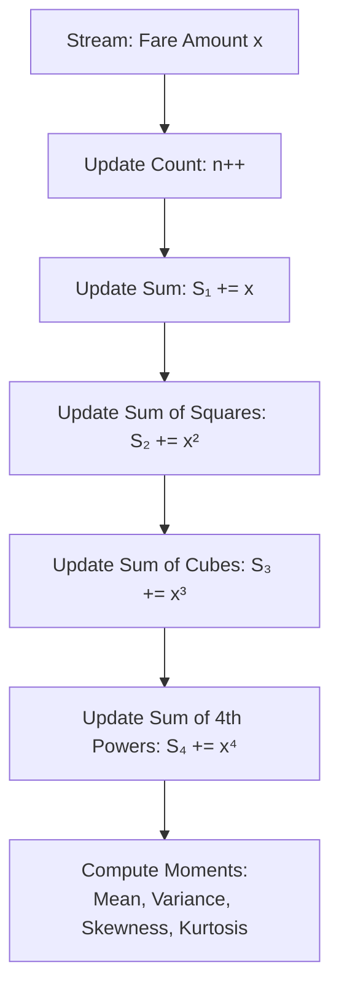

**Moment Definitions:**

| Moment | Formula | Interpretation | Memory |
|--------|---------|----------------|---------|
| **1st (Mean)** | μ = S₁/n | Average fare | O(1) |
| **2nd (Variance)** | σ² = S₂/n - μ² | Fare variability | O(1) |
| **3rd (Skewness)** | γ = (S₃/n - 3μσ² - μ³)/σ³ | Fare distribution asymmetry | O(1) |
| **4th (Kurtosis)** | κ = (S₄/n - 4μS₃/n + 6μ²S₂/n - 3μ⁴)/σ⁴ | Outlier detection | O(1) |

**Stratified Moments by Dimension:**

| Dimension | Strata | Moment Insights |
|-----------|--------|-----------------|
| **Time of Day** | Hourly buckets | Peak hour fare volatility |
| **Borough** | 5 NYC boroughs | Geographic fare patterns |
| **Trip Distance** | Short/Medium/Long | Distance-based pricing distribution |

### 6.6 Graph Stream Algorithm Design

**Purpose:** Analyze trip network structure (zones as nodes, trips as edges) in streaming fashion

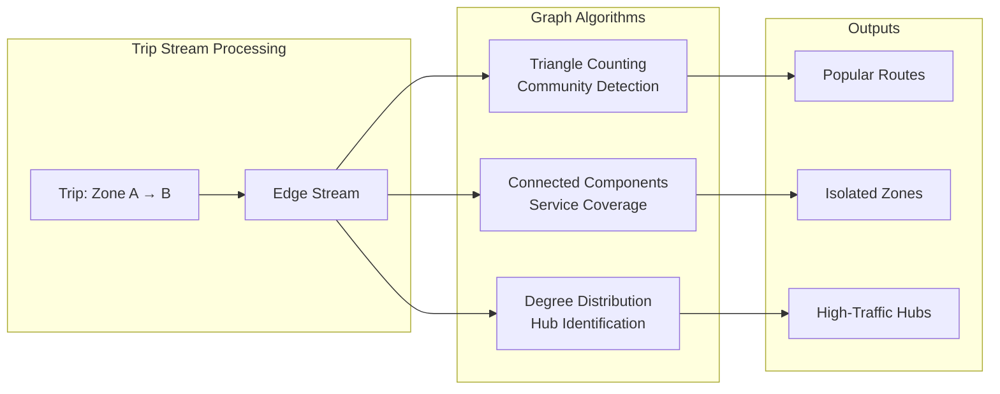

**Graph Stream Algorithms:**

| Algorithm | Purpose | Memory | Application |
|-----------|---------|---------|-------------|
| **Triangle Counting** | Detect trip cycles (A→B→C→A) | O(√m) edges | Identify circular route patterns |
| **Gou-Williamson** | Estimate connected components | O(n log n) | Find disconnected service areas |
| **Degree Sketching** | Track hub zones (high in/out degree) | O(k) counters | Detect major pickup/dropoff hubs |
| **Spanning Tree Approx** | Minimum connection cost | O(n log n) | Optimize fleet distribution |

**Zone Graph Metrics (2020 vs 2025):**

| Metric | 2020 Baseline | 2025 Target | Insight |
|--------|---------------|-------------|---------|
| **Graph Density** | Trips/zone pairs | Post-pandemic change | Service expansion/contraction |
| **Average Clustering** | Triangle density | Community strength | Route clustering patterns |
| **Hub Count (degree > 1000)** | Top hubs | Demand shift | High-traffic zone evolution |

## 6.7 Streaming Framework Integration

### Spark Streaming + Flink Dual Processing

**Architecture:**

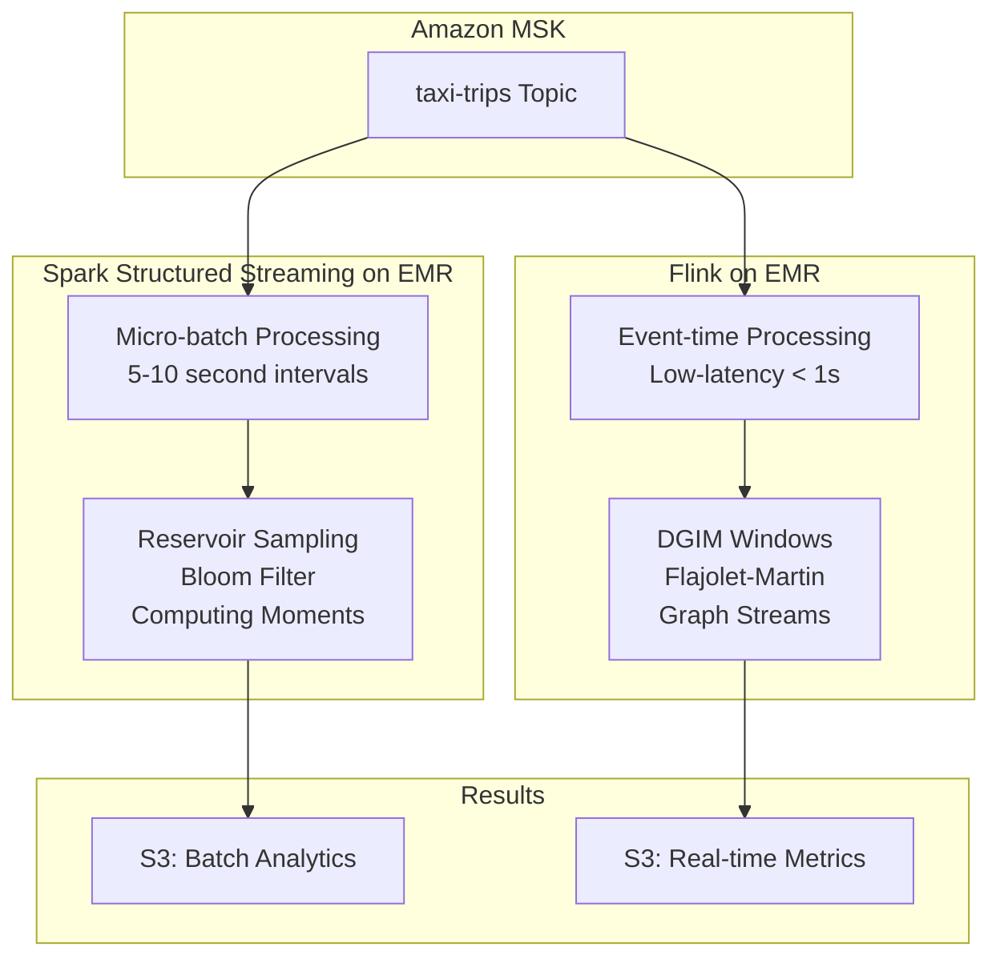

**Framework Comparison:**

| Feature | Spark Structured Streaming | Apache Flink |
|---------|---------------------------|--------------|
| **Processing Model** | Micro-batch (5-10s) | True streaming (event-time) |
| **Latency** | Seconds | Milliseconds |
| **Best For** | Reservoir Sampling, Bloom Filter, Moments | DGIM, Flajolet-Martin, Graph Streams |
| **State Management** | RocksDB/memory | Distributed snapshots |
| **EMR Integration** | Native (EMR 6.x+) | EMR 6.x+ application |

## 7. Locality Sensitive Hashing (LSH) Design

### 7.1 LSH for Similar Trip Detection

**Purpose:** Find similar taxi trips (near-duplicate routes, similar fare patterns) without comparing all pairs

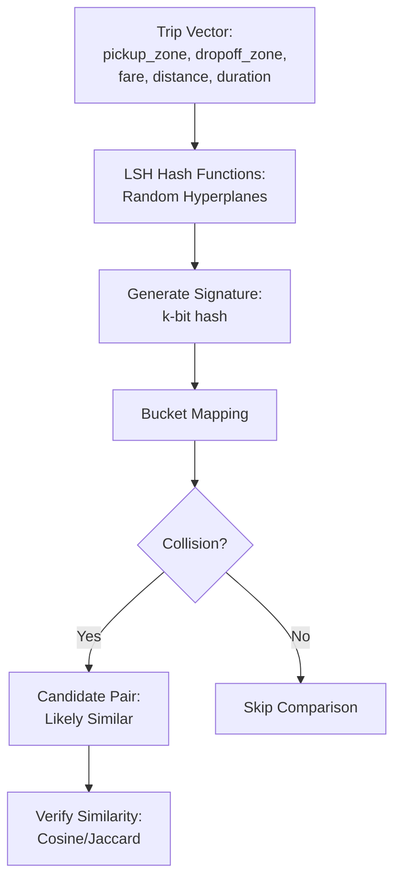

### 7.2 LSH Configuration for Taxi Data

**Trip Feature Vectorization:**

| Feature Type | Encoding | Dimension |
|--------------|----------|-----------|
| **Spatial** | One-hot encode 265 NYC zones | 265-dim |
| **Temporal** | Hour of day (0-23) one-hot | 24-dim |
| **Fare** | Normalized fare buckets | 10-dim |
| **Distance** | Normalized distance buckets | 10-dim |
| **Total Vector** | Concatenated | 309-dim |

**LSH Parameters:**

| Parameter | Value | Rationale |
|-----------|-------|-----------|
| **Hash Functions (k)** | 20 | Balance false positive/negative |
| **Hash Tables (L)** | 10 | Increase recall |
| **Signature Length** | 64 bits | Compact representation |
| **Similarity Threshold** | 0.8 (Jaccard/Cosine) | High similarity detection |

**Applications:**

| Use Case | LSH Application | Benefit |
|----------|-----------------|---------|
| **Route Clustering** | Find trips with similar pickup/dropoff zones | Identify popular route templates |
| **Fare Anomaly Detection** | Detect trips with unusual fare for similar route | Fraud detection |
| **Demand Prediction** | Find historical trips similar to current request | Accurate fare/time estimates |

### 7.3 MinHash for Trip Set Similarity

**Purpose:** Compare sets of trips (e.g., driver trip histories, hourly trip batches)

| Set Comparison | MinHash Sketches | Jaccard Estimation | Use Case |
|----------------|------------------|--------------------| ---------|
| **Driver Similarity** | 128 hash functions | ±0.05 error | Find drivers with similar route patterns |
| **Hourly Demand** | 64 hash functions | ±0.1 error | Compare demand across time periods |
| **Zone Affinity** | 256 hash functions | ±0.02 error | Identify zones with similar trip profiles |

## 7. Ground Truth Baseline Design

### 7.1 EMR MapReduce Ground Truth Pipeline

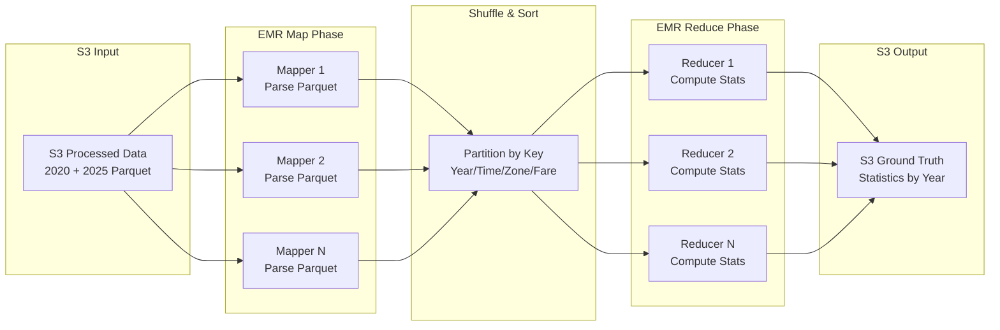

### 7.2 Ground Truth Metrics (Year-wise Comparison)

| Metric Category | Measurements | 2020 Baseline | 2025 Baseline |
|-----------------|--------------|---------------|---------------|
| **Trip Duration** | Mean, median, std dev, percentiles | Pandemic impact analysis | Current patterns |
| **Fare Distribution** | Mean, median, mode, variance | 2020 pricing baseline | 2025 pricing trends |
| **Temporal Patterns** | Hourly/daily/weekly aggregates | COVID-era demand | Post-pandemic demand |
| **Spatial Analytics** | Zone-wise demand, borough distribution | 2020 geographic patterns | 2025 hotspots |
| **Duplicate Count** | Exact duplicate trip_id count | 2020 data quality | 2025 data quality |
| **Year-over-Year** | Growth rates, pattern shifts | Comparative analysis | Trend identification |

## 8. Privacy-Preserving Techniques Design

### 8.1 K-Anonymity Implementation

**Purpose:** Protect passenger/driver privacy by ensuring each record is indistinguishable from at least k-1 other records

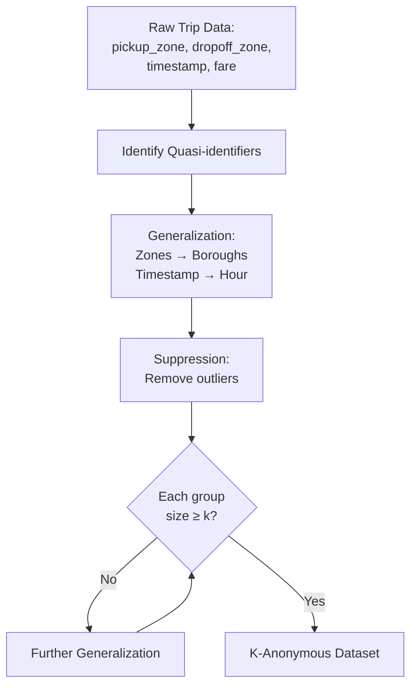

**Quasi-Identifier Generalization Strategy:**

| Attribute | Original Granularity | K-Anonymized (k=5) | K-Anonymized (k=100) | Information Loss |
|-----------|---------------------|-------------------|---------------------|------------------|
| **Pickup Zone** | 265 zones | 71 neighborhoods | 5 boroughs | Low → High |
| **Dropoff Zone** | 265 zones | 71 neighborhoods | 5 boroughs | Low → High |
| **Pickup Time** | Second precision | 15-minute bins | 1-hour bins | Low → High |
| **Trip Date** | Exact date | Week of year | Month | Low → High |
| **Passenger Count** | Exact (1-6) | Binary (solo/group) | Suppressed | Medium |

**K-Anonymity Configuration:**

| k Value | Privacy Level | Data Utility | Use Case |
|---------|--------------|--------------|----------|
| **k=5** | Low | High | Internal analytics |
| **k=25** | Medium | Medium | Research sharing |
| **k=100** | High | Low | Public release |

**AWS EMR Implementation:**

| Stage | EMR Component | Process |
|-------|---------------|---------|
| **1. Partition** | Spark SQL | Group by quasi-identifiers |
| **2. Generalization** | UDF in PySpark | Hierarchical generalization (zone→neighborhood→borough) |
| **3. Validation** | Spark aggregation | Verify group sizes ≥ k |
| **4. Output** | S3 anonymized bucket | Partitioned Parquet with k-anonymity guarantees |

### 8.2 L-Diversity Implementation

**Purpose:** Enhance k-anonymity by ensuring diversity in sensitive attributes (fare, trip purpose) within each equivalence class

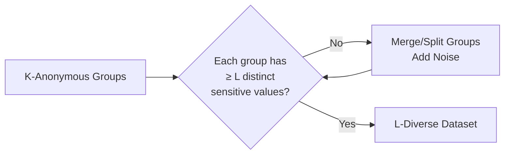

**Sensitive Attribute Diversity:**

| Sensitive Attribute | L-Diversity Requirement | Verification |
|---------------------|------------------------|--------------|
| **Fare Amount** | L=3 distinct fare buckets (low/med/high) | Ensure each k-anonymous group has trips from ≥3 fare tiers |
| **Trip Distance** | L=4 distance categories | Short/medium/long/very long representation |
| **Trip Type** | L=2 (business/personal heuristic) | Peak vs off-peak diversity |

**Configuration Matrix:**

| Privacy Model | k | L | Information Preserved | Privacy Guarantee |
|---------------|---|---|----------------------|-------------------|
| **Basic** | k=10 | L=3 | 85% | Moderate |
| **Standard** | k=25 | L=5 | 70% | Strong |
| **High Privacy** | k=100 | L=10 | 50% | Very Strong |

### 8.3 Differential Privacy Implementation

**Purpose:** Add calibrated noise to aggregate statistics to prevent individual trip identification

```mermaid
flowchart TD
    A[True Aggregate Query:<br/>COUNT, AVG, SUM] --> B[Compute Sensitivity Δf]
    B --> C[Set Privacy Budget ε]
    C --> D[Generate Laplace Noise:<br/>Lap(Δf/ε)]
    D --> E[Add Noise to Result]
    E --> F[Return Noisy Answer]
```

**Differential Privacy Parameters:**

| Query Type | Sensitivity (Δf) | Privacy Budget (ε) | Noise Scale | Accuracy Trade-off |
|------------|------------------|-------------------|-------------|-------------------|
| **Trip Count** | 1 trip | ε=0.1 (strict) | Lap(10) | ±10 trips noise |
| **Average Fare** | Max fare ($200) | ε=0.5 (moderate) | Lap(400) | ±$8 noise |
| **Zone Demand** | 1 zone count | ε=1.0 (relaxed) | Lap(1) | ±1 trip noise |

**Composition Budget Management:**

| Time Period | Total Queries | Budget per Query | Total ε Spent | Remaining Privacy |
|-------------|--------------|------------------|---------------|-------------------|
| **Daily** | 100 queries | ε=0.01 | ε=1.0 | Refreshes next day |
| **Weekly** | 500 queries | ε=0.005 | ε=2.5 | Degraded privacy |
| **Monthly** | 2000 queries | ε=0.001 | ε=2.0 | Careful monitoring |

**AWS Implementation:**

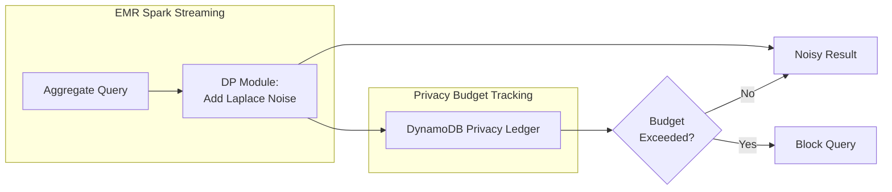

### 8.4 Privacy-Utility Trade-off Analysis

| Privacy Technique | Computational Overhead | Memory Overhead | Query Accuracy | Best Use Case |
|-------------------|----------------------|-----------------|----------------|---------------|
| **K-Anonymity** | Low (pre-processing) | 1x data size | 80-95% | Microdata release |
| **L-Diversity** | Medium (grouping) | 1.2x data size | 70-90% | Rich attribute sets |
| **Differential Privacy** | Low (noise addition) | Minimal | 85-99% (depends on ε) | Aggregate queries |
| **Combined (K-Anon + DP)** | Medium | 1.2x | 75-90% | Maximum protection |

### 8.5 Privacy-Preserving Analytics Pipeline

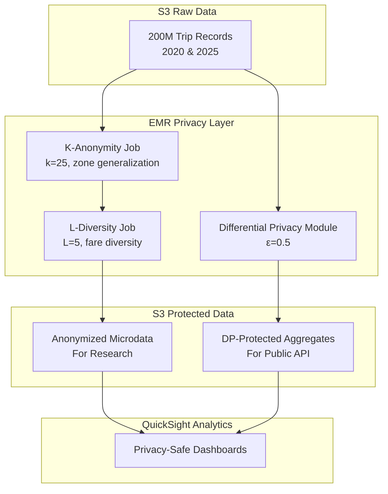

## 9. Responsible AI & Advanced ML Techniques

### 9.1 Fairness in Dynamic Pricing

**Purpose:** Ensure fare predictions and surge pricing don't discriminate based on protected zone characteristics (income, demographics)

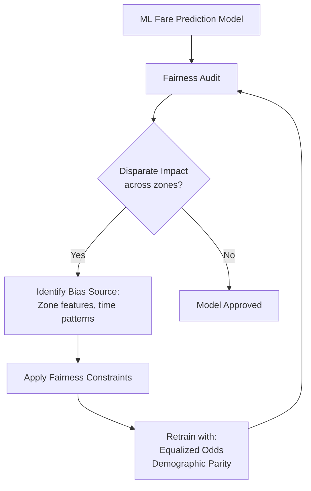

**Fairness Metrics:**

| Metric | Definition | Threshold | Application |
|--------|------------|-----------|-------------|
| **Demographic Parity** | P(fare_surge \| zone_A) ≈ P(fare_surge \| zone_B) | Ratio within [0.8, 1.2] | Equal surge probability across zones |
| **Equalized Odds** | TPR and FPR equal across zone groups | Difference < 0.1 | Fair demand prediction |
| **Calibration** | Predicted probabilities match observed rates | R² > 0.9 | Accurate confidence estimates |

**Protected Attributes (Proxy Detection):**

| Direct Attribute | Proxy in Data | Mitigation |
|------------------|---------------|------------|
| **Income Level** | Pickup/dropoff zone | Remove zone from model, use coarser spatial features |
| **Race/Ethnicity** | Neighborhood patterns | Aggregate to borough level |
| **Disability** | Trip duration anomalies | Avoid penalizing longer trips |

**Fairness-Aware Model Training (EMR Spark MLlib):**

| Stage | Component | Fairness Intervention |
|-------|-----------|----------------------|
| **Feature Engineering** | Zone encoding | Use borough instead of zone (71→5 categories) |
| **Model Training** | Gradient Boosting | Add fairness regularization term |
| **Post-processing** | Threshold adjustment | Calibrate thresholds per zone group |
| **Validation** | Holdout test | Measure disparate impact metrics |

### 9.2 Explainable AI (XAI) for Fare Predictions

**Purpose:** Provide interpretable explanations for dynamic fare estimates to build user trust

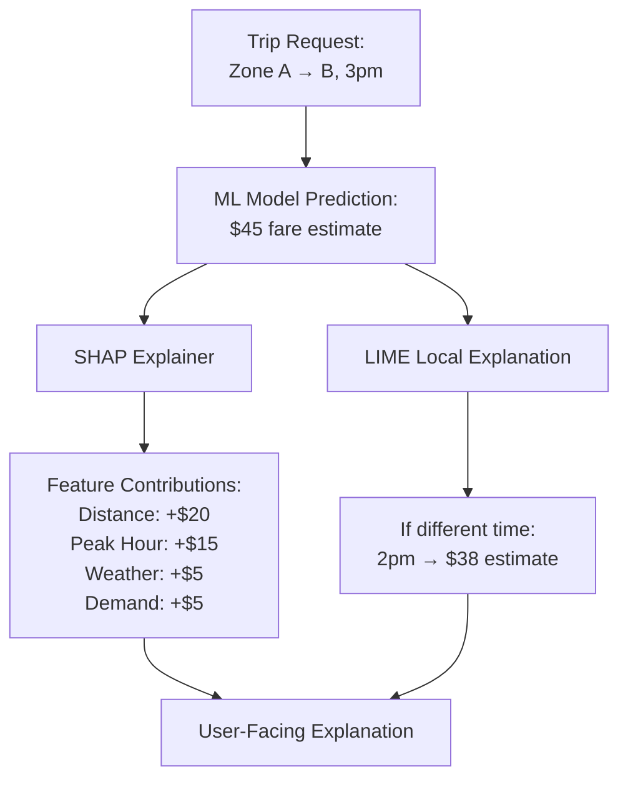

**XAI Techniques:**

| Method | Scope | Computational Cost | Output | Use Case |
|--------|-------|-------------------|--------|----------|
| **SHAP (SHapley Additive)** | Global + Local | High (pre-compute on EMR) | Feature importance per trip | Detailed breakdown |
| **LIME** | Local | Medium (on-demand) | Counterfactual explanations | "What-if" scenarios |
| **Feature Importance** | Global | Low (model intrinsic) | Overall ranking | Model debugging |
| **Anchor Explanations** | Local | Low | Decision rules | Simple user explanation |

**Explanation Dashboard (QuickSight):**

| Panel | Visualization | Metric | User Benefit |
|-------|--------------|--------|--------------|
| **Fare Breakdown** | Stacked bar chart | Base + distance + time + demand components | Transparent pricing |
| **Comparison** | Line chart | Your fare vs. typical fare for route | Context understanding |
| **Sensitivity** | Tornado chart | Impact of changing pickup time ±30min | Trip planning |

### 9.3 Machine Unlearning Implementation

**Purpose:** Remove specific trips (e.g., user data deletion requests, GDPR/CCPA compliance) from trained models

```mermaid
flowchart TD
    A[User Deletion Request:<br/>trip_ids to forget] --> B{Model Type}
    B -->|Linear Models| C[Exact Unlearning:<br/>Update weights using influence functions]
    B -->|Tree Models| D[Approximate Unlearning:<br/>Retrain affected trees]
    B -->|Neural Networks| E[SISA Unlearning:<br/>Retrain affected shard]

    C --> F[Validate Forgetting]
    D --> F
    E --> F
    F --> G{Membership<br/>Inference Attack}
    G -->|Cannot detect| H[Unlearning Success]
    G -->|Can detect| I[Repeat Unlearning]
```

**Unlearning Strategies:**

| Model Type | Unlearning Method | Time Complexity | Accuracy Preservation |
|------------|-------------------|-----------------|----------------------|
| **Linear Regression** | Influence Function | O(d²) per sample | 100% (exact) |
| **Random Forest** | Selective Retrain | O(k trees affected) | 98-99% |
| **Neural Network (SISA)** | Shard Retrain (1 of 10 shards) | O(n/10) samples | 95-98% |
| **Ensemble Models** | Remove & reweight | O(1) | 90-95% |

**SISA (Sharded, Isolated, Sliced, Aggregated) Architecture on EMR:**

```mermaid
graph TB
    subgraph "Data Sharding"
        D[200M Trips] --> S1[Shard 1<br/>20M trips]
        D --> S2[Shard 2<br/>20M trips]
        D --> S10[Shard 10<br/>20M trips]
    end

    subgraph "Model Training"
        S1 --> M1[Model 1]
        S2 --> M2[Model 2]
        S10 --> M10[Model 10]
    end

    subgraph "Ensemble"
        M1 --> AGG[Aggregate Predictions]
        M2 --> AGG
        M10 --> AGG
    end

    subgraph "Unlearning"
        DEL[Delete trip from<br/>Shard 5] --> RETRAIN[Retrain only Model 5]
        RETRAIN --> AGG
    end
```

**Unlearning Performance:**

| Deletion Request Size | Affected Shards | Retraining Time (EMR) | Model Accuracy Impact |
|----------------------|----------------|----------------------|----------------------|
| **1 trip** | 1 shard | ~2 hours | < 0.01% |
| **100 trips** | 1-2 shards | ~4 hours | < 0.05% |
| **10,000 trips** | 3-5 shards | ~12 hours | < 0.2% |
| **1M trips** | All 10 shards | ~48 hours (full retrain) | 0.5-1% |

### 9.4 Federated Learning for Privacy-Preserving Model Training

**Purpose:** Train global fare prediction model without centralizing individual taxi fleet data

```mermaid
sequenceDiagram
    participant F1 as Fleet 1 (Yellow Cabs)
    participant F2 as Fleet 2 (Green Cabs)
    participant F3 as Fleet 3 (Ride-share)
    participant Server as EMR Central Server

    Server->>F1: Global Model v1
    Server->>F2: Global Model v1
    Server->>F3: Global Model v1

    F1->>F1: Local Training (100K trips)
    F2->>F2: Local Training (80K trips)
    F3->>F3: Local Training (120K trips)

    F1->>Server: Model Gradient Δθ₁
    F2->>Server: Model Gradient Δθ₂
    F3->>Server: Model Gradient Δθ₃

    Server->>Server: Aggregate: θ = θ + (Δθ₁+Δθ₂+Δθ₃)/3
    Server->>F1: Updated Model v2
```

**Federated Learning Configuration:**

| Parameter | Value | Rationale |
|-----------|-------|-----------|
| **Clients (Fleets)** | 10 taxi companies | Diverse data sources |
| **Local Epochs** | 5 per round | Balance communication vs. accuracy |
| **Communication Rounds** | 100 rounds | Convergence |
| **Aggregation** | FedAvg (Federated Averaging) | Simple, effective |
| **Privacy Enhancement** | Secure Aggregation + DP (ε=1.0) | Prevent gradient leakage |

**Advantages for Taxi Industry:**

| Benefit | Impact |
|---------|--------|
| **Data Privacy** | Fleets don't share raw trip data (competitive advantage) |
| **Regulatory Compliance** | GDPR/CCPA compliant (data stays local) |
| **Improved Accuracy** | Global model learns from 10x more data |
| **Fairness** | Model sees diverse fleet patterns |

### 9.5 Data Poisoning Detection & Defense

**Purpose:** Detect and mitigate malicious trip injection attacks (fake demand, fare manipulation)

```mermaid
flowchart TD
    A[Incoming Trip Stream] --> B[Anomaly Detection:<br/>Isolation Forest, Autoencoder]
    B --> C{Anomaly Score<br/>> Threshold?}
    C -->|Yes| D[Potential Poisoning]
    C -->|No| E[Accept Trip]

    D --> F[Quarantine for Review]
    F --> G[Human Audit or<br/>Secondary Validation]
    G --> H{Confirmed<br/>Poisoning?}
    H -->|Yes| I[Block Source,<br/>Retrain Model]
    H -->|No| E
```

**Poisoning Attack Types:**

| Attack Type | Description | Detection Method | Defense |
|-------------|-------------|------------------|---------|
| **Label Flipping** | Alter fare amounts in training data | Gradient analysis, outlier detection | Robust loss functions (Huber) |
| **Feature Manipulation** | Inject fake high-demand trips | Statistical tests (KS-test, χ²) | RANSAC, Median aggregation |
| **Backdoor Injection** | Trigger-based fare inflation | Activation clustering | Neural Cleanse, Fine-Pruning |

**AWS Detection Pipeline:**

```mermaid
graph LR
    subgraph "MSK Stream"
        TRIPS[Taxi Trips]
    end

    subgraph "EMR Flink Real-time Detection"
        AD[Anomaly Detector:<br/>Isolation Forest]
        STAT[Statistical Tests:<br/>Distribution Shift]
    end

    subgraph "S3 Quarantine"
        Q[Suspicious Trips]
    end

    subgraph "CloudWatch Alerts"
        ALERT[SNS Notification]
    end

    TRIPS --> AD
    TRIPS --> STAT
    AD --> Q
    STAT --> Q
    Q --> ALERT
```

**Detection Metrics:**

| Metric | Threshold | False Positive Rate | Action |
|--------|-----------|-------------------|--------|
| **Isolation Forest Score** | > 0.7 | 1% | Quarantine |
| **Distribution Shift (KL Divergence)** | > 0.5 | 2% | Alert + Review |
| **Gradient Norm** | > 3σ from mean | 0.5% | Remove sample |

### 9.6 Responsible AI Governance Framework

```mermaid
graph TB
    subgraph "Design Phase"
        A[Fairness Requirements] --> B[Model Card Documentation]
        C[Privacy Requirements] --> B
        D[Explainability Requirements] --> B
    end

    subgraph "Development Phase"
        B --> E[Bias Testing]
        B --> F[Privacy Audit]
        B --> G[XAI Integration]
    end

    subgraph "Deployment Phase"
        E --> H[Continuous Monitoring<br/>CloudWatch Metrics]
        F --> H
        G --> H
        H --> I{Drift or<br/>Bias Detected?}
        I -->|Yes| J[Trigger Retraining<br/>or Investigation]
        I -->|No| K[Continue Serving]
    end

    subgraph "Audit Trail"
        J --> L[S3 Governance Logs<br/>Model Versions, Decisions]
        K --> L
    end
```

**Model Card Template (S3 Documented):**

| Section | Content | Purpose |
|---------|---------|---------|
| **Model Details** | Architecture, hyperparameters, training data (2020/2025) | Reproducibility |
| **Intended Use** | Fare estimation, demand forecasting | Prevent misuse |
| **Metrics** | RMSE, MAE, R² + fairness metrics | Performance transparency |
| **Limitations** | Low accuracy for edge cases (extreme weather) | Set expectations |
| **Ethical Considerations** | Zone-based bias mitigation, privacy protections | Accountability |

## 10. Performance Evaluation Design

### 8.1 Accuracy Validation Framework (AWS)

```mermaid
graph TB
    GT[EMR MapReduce<br/>Ground Truth S3] --> COMP[EMR Comparison Job]
    RS[Reservoir Sample<br/>from MSK] --> COMP
    BF[Bloom Filter<br/>from MSK] --> COMP

    COMP --> MAE[Mean Absolute Error]
    COMP --> RMSE[Root Mean Squared Error]
    COMP --> FPR[False Positive Rate]
    COMP --> CI[95% Confidence Intervals]

    MAE --> S3_REPORT[S3 Performance Report]
    RMSE --> S3_REPORT
    FPR --> S3_REPORT
    CI --> S3_REPORT

    S3_REPORT --> QS[QuickSight Dashboards]
    S3_REPORT --> CW[CloudWatch Metrics]
```

**Error Metrics:**

| Metric | Formula | Acceptable Threshold | Purpose |
|--------|---------|---------------------|---------|
| **MAE** | Σ\|predicted - actual\| / n | < 5% | Average deviation |
| **RMSE** | √(Σ(predicted - actual)² / n) | < 7% | Penalize large errors |
| **False Positive Rate** | FP / (FP + TN) | < 1% | Bloom filter accuracy |
| **Sample Bias** | \|sample_mean - population_mean\| | < 2% | Sampling quality |

### 8.2 AWS Performance Testing Matrix

| Test Category | Metrics | AWS Measurement Method |
|---------------|---------|------------------------|
| **Memory Efficiency** | Peak usage, allocation patterns | EMR JVM profiling, CloudWatch |
| **Throughput** | Records/second, events/minute | MSK metrics, Spark UI, CloudWatch |
| **Latency** | End-to-end processing time, p99 latency | CloudWatch Insights, X-Ray tracing |
| **Scalability** | Performance at 1M, 10M, 50M, 100M, 200M records | EMR auto-scaling testing |
| **Resource Utilization** | CPU, memory, network, disk I/O | CloudWatch, EMR metrics |
| **Cost Efficiency** | Processing cost per million records | AWS Cost Explorer |

### 8.3 AWS Bottleneck Analysis & Optimization

```mermaid
graph TD
    A[CloudWatch Performance Test] --> B{Identify Bottleneck}
    B -->|Low throughput| C[CPU Bottleneck]
    B -->|High latency| D[Network Bottleneck]
    B -->|Memory pressure| E[Memory Bottleneck]
    B -->|Slow S3 reads| F[I/O Bottleneck]

    C --> G[Scale: Add EMR task nodes]
    D --> H[Optimize: MSK compression, batching]
    E --> I[Scale: Larger instance types, tune GC]
    F --> J[Optimize: S3A committers, parallel reads]
```

## 9. AWS Real-time Analytics Dashboard Design

### 9.1 QuickSight Dashboard Components

| Panel | Visualizations | Metrics Displayed | Data Source | Refresh |
|-------|---------------|-------------------|-------------|---------|
| **EMR Health** | Gauge charts, time series | CPU, memory, cluster status | CloudWatch | 1 minute |
| **MSK Performance** | Line charts | Throughput, consumer lag | MSK metrics | 1 minute |
| **Algorithm Accuracy** | Line charts, error bars | MAE, RMSE vs ground truth (2020 vs 2025) | S3 results | 5 minutes |
| **Geographic View** | Interactive NYC map, heatmap | Zone demand (2020 vs 2025) | S3 Athena query | 5 minutes |
| **Temporal Comparison** | Dual time-series | 2020 vs 2025 hourly demand | S3 Athena query | 5 minutes |
| **Fare Analytics** | Distribution plots, box plots | Fare trends (2020 vs 2025) | S3 Athena query | 5 minutes |
| **Duplicate Detection** | Counter widgets, pie charts | Bloom filter stats by year | S3 results | 5 minutes |

### 9.2 AWS Dashboard Architecture

```mermaid
graph LR
    subgraph "AWS Data Sources"
        EMR[EMR Metrics]
        MSK[MSK Metrics]
        S3_RES[S3 Results<br/>Parquet]
    end

    subgraph "AWS Analytics Services"
        CW[CloudWatch<br/>Metrics & Logs]
        ATHENA[Athena<br/>SQL on S3]
        GLUE[Glue Catalog<br/>Schema Registry]
    end

    subgraph "Visualization"
        QS[QuickSight<br/>Interactive Dashboards]
    end

    subgraph "Alerts"
        SNS[SNS Topics<br/>Threshold Alerts]
        LAMBDA[Lambda<br/>Custom Actions]
    end

    EMR --> CW
    MSK --> CW
    S3_RES --> GLUE
    GLUE --> ATHENA

    CW --> QS
    ATHENA --> QS
    CW --> SNS
    SNS --> LAMBDA
```

## 10. Data Validation Strategy

### 10.1 Multi-source Validation

| Validation Type | Check | Action on Failure |
|-----------------|-------|-------------------|
| **Schema Consistency** | Column names, data types match across TLC/S3/Azure | Log inconsistency, use TLC as primary |
| **Temporal Alignment** | Timestamp ranges match expected periods | Filter out-of-range records |
| **Referential Integrity** | Location IDs exist in zone lookup | Drop invalid trips, log count |
| **Data Completeness** | Required fields non-null | Impute or drop based on % missing |
| **Range Validation** | Fare > 0, distance > 0, passengers > 0 | Flag anomalies, apply filters |

### 10.2 AWS Data Cleaning Pipeline

```mermaid
flowchart TD
    A[S3 Raw Parquet<br/>2020 & 2025] --> B[EMR Spark Validation Job]
    B --> C{Valid Schema?}
    C -->|No| D[Log to CloudWatch & Skip]
    C -->|Yes| E[Null Check]
    E --> F{Critical Nulls?}
    F -->|Yes| D
    F -->|No| G[Range Validation]
    G --> H{In Range?}
    H -->|No| I[Flag Anomaly<br/>CloudWatch Metric]
    H -->|Yes| J[Year Filter<br/>2020 or 2025 only]
    I --> J
    J --> K{Duplicate?}
    K -->|Yes| L[Mark & Track in S3]
    K -->|No| M[S3 Processed Bucket<br/>Partitioned by Year]
    L --> M
```


### 11.2 AWS Component Dependencies

```mermaid
graph TD
    A[AWS Account Setup] --> B[S3 Bucket Creation]
    B --> C[Download 2020 & 2025 Data]
    C --> D[EMR Cluster Launch]
    D --> E[Data Validation Job]
    E --> F[MapReduce Baseline]
    E --> G[MSK Cluster Setup]
    G --> H[Spark Streaming Jobs]
    F --> I[Algorithm Implementation]
    H --> I
    I --> J[Performance Evaluation]
    I --> K[QuickSight Dashboard]
    J --> L[Final Report]
    K --> L
```
\