# Design Document: StreamTide - NYC Taxi Big Data Analytics System

## 1. System Overview

StreamTide is a real-time analytics system for NYC taxi demand modeling and dynamic fare optimization. The system processes historical taxi trip records from years 2020 and 2025 using streaming algorithms (Reservoir Sampling and Bloom Filters) to detect demand surges, estimate trip distributions, and provide insights into fare dynamics.

**Data Source:** NYC Taxi & Limousine Commission (TLC) - 2020 & 2025 records in Parquet format (~200M+ records)
**Cloud Platform:** AWS (Amazon Web Services)

## 2. System Architecture

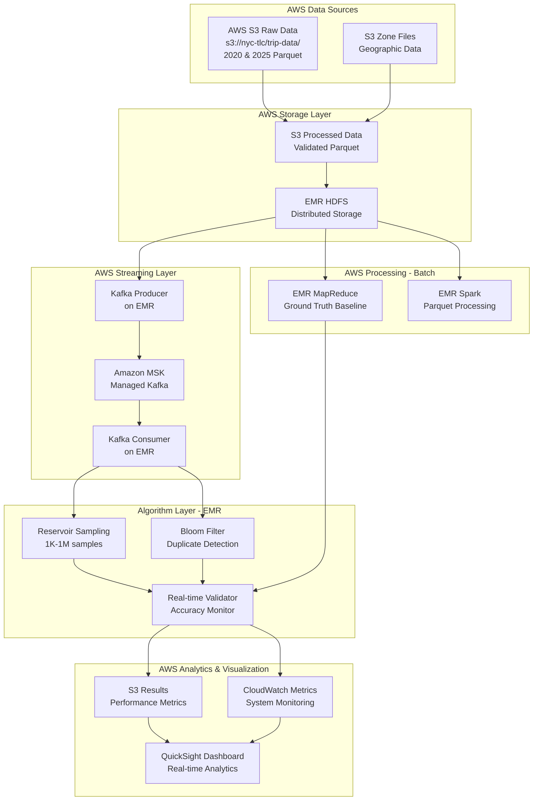

## 3. Data Pipeline Design

### 3.1 Data Flow Stages

| Stage | Component | Input | Output | Purpose |
|-------|-----------|-------|--------|---------|
| **Ingestion** | AWS CLI / SDK | S3 nyc-tlc bucket (2020, 2025) | Raw Parquet files | Acquire ~200M records |
| **Validation** | EMR Spark job | Raw Parquet from S3 | Validated dataset | Schema check, integrity |
| **Storage** | S3 + EMR HDFS | Validated data | S3 processed bucket | Fault-tolerant storage |
| **Baseline** | EMR MapReduce | S3/HDFS data | Ground truth metrics | Statistical baselines |
| **Streaming** | MSK producer on EMR | S3/HDFS data | Kafka topics | Real-time simulation |
| **Processing** | EMR Spark + Algorithms | MSK stream | Analytics results | Demand/fare analysis |
| **Visualization** | QuickSight + CloudWatch | S3 results, CW metrics | Interactive dashboards | Monitoring & insights |

### 3.2 Data Schema Structure

| Field Category | Fields | Data Type | Purpose |
|----------------|--------|-----------|---------|
| **Trip Identity** | trip_id, vendor_id | String | Unique identification |
| **Temporal** | pickup_datetime, dropoff_datetime | Timestamp | Time-series analysis |
| **Spatial** | pickup_location_id, dropoff_location_id | Integer | Zone-based demand |
| **Fare** | fare_amount, tip_amount, total_amount | Decimal | Pricing analysis |
| **Metrics** | trip_distance, passenger_count | Float/Integer | Trip characteristics |

## 4. AWS Infrastructure Design

### 4.1 AWS EMR Cluster Architecture

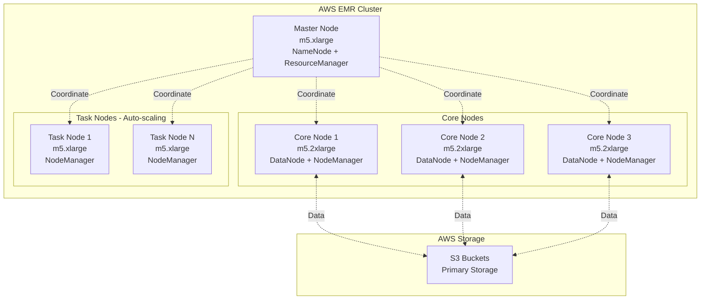

**EMR Cluster Specifications:**

| Parameter | Configuration | Rationale |
|-----------|--------------|-----------|
| **Master Node** | 1x m5.xlarge (4 vCPU, 16 GB) | Cluster coordination, lightweight |
| **Core Nodes** | 3x m5.2xlarge (8 vCPU, 32 GB) | HDFS storage + processing |
| **Task Nodes** | 2-10x m5.xlarge (auto-scale) | Flexible compute for peak loads |
| **EMR Version** | 6.10+ or 7.x | Latest Spark 3.x, Kafka support |
| **HDFS Replication** | 3x | Fault tolerance within EMR |
| **S3 Storage** | 2-5 TB (2020+2025 data) | Primary durable storage |

### 4.2 EMR Spark Configuration

| Component | Configuration | Purpose |
|-----------|--------------|---------|
| **Execution Mode** | Cluster mode on EMR | Distributed processing |
| **Executor Memory** | 8-12 GB per executor | Handle 200M+ record processing |
| **Executor Cores** | 4 cores per executor | Parallel task execution |
| **Driver Memory** | 8 GB | Manage job coordination |
| **Partitioning** | 200-400 partitions | Optimize parallelism |
| **Optimizer** | Catalyst + Tungsten | Query optimization, code generation |
| **S3 Integration** | S3A connector with committers | Efficient S3 read/write |

### 4.3 AWS S3 Bucket Structure

| Bucket/Prefix | Purpose | Data Format | Lifecycle |
|---------------|---------|-------------|-----------|
| **s3://nyc-taxi-raw/** | Raw TLC data download | Parquet (2020, 2025) | Retain 90 days |
| **s3://nyc-taxi-processed/** | Validated, cleaned data | Parquet (partitioned) | Retain indefinitely |
| **s3://nyc-taxi-results/** | Ground truth, algorithm output | Parquet, JSON | Retain 180 days |
| **s3://nyc-taxi-logs/** | EMR logs, application logs | Text, JSON | Retain 30 days |
| **s3://nyc-taxi-checkpoints/** | Spark streaming checkpoints | Binary | Retain 7 days |

## 5. AWS Streaming Architecture Design

### 5.1 Amazon MSK (Managed Streaming for Kafka) Setup

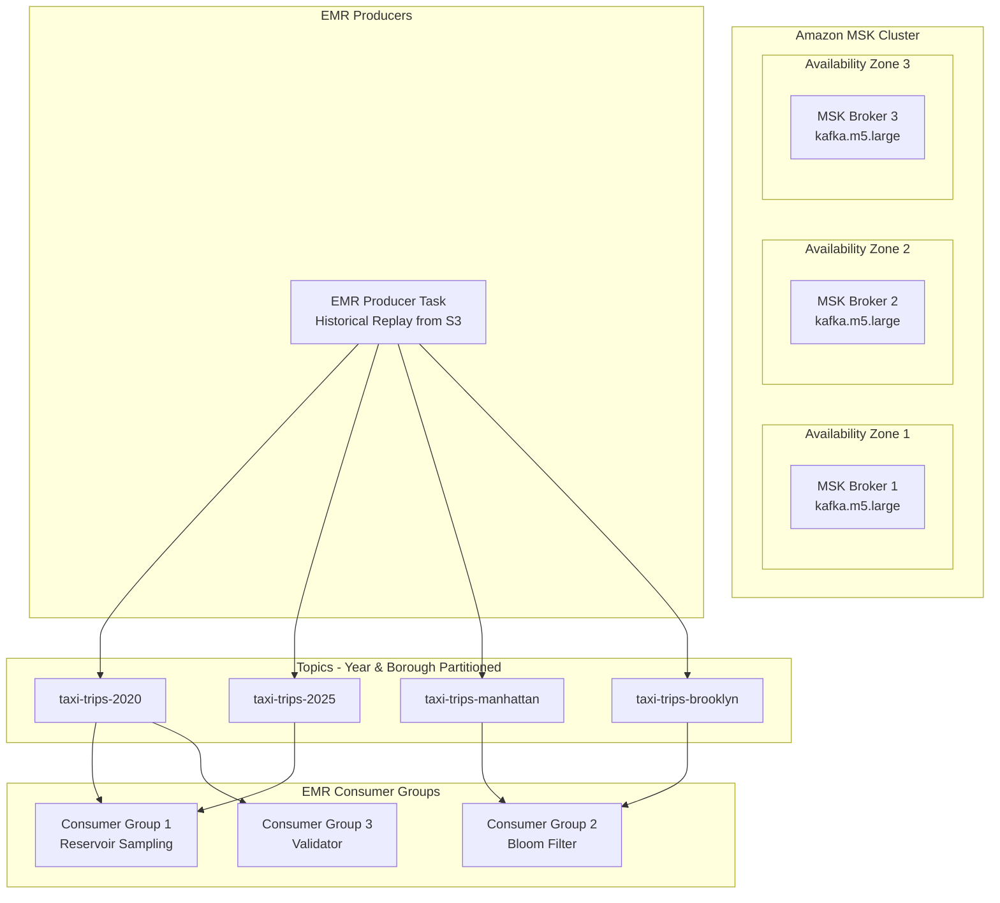

**Amazon MSK Configuration:**

| Parameter | Value | Rationale |
|-----------|-------|-----------|
| **Broker Type** | kafka.m5.large (2 vCPU, 8 GB) | Cost-effective for 200M records |
| **Brokers** | 3 brokers (multi-AZ) | High availability, fault tolerance |
| **Partitions** | 12 per topic | Parallel consumption, scalability |
| **Replication** | 3x (across AZs) | Data durability |
| **Retention** | 7 days | Allow replay for validation |
| **Compression** | Snappy | Reduce network/storage overhead |
| **Authentication** | IAM + TLS | Secure access from EMR |

### 5.2 AWS Stream Processing Flow

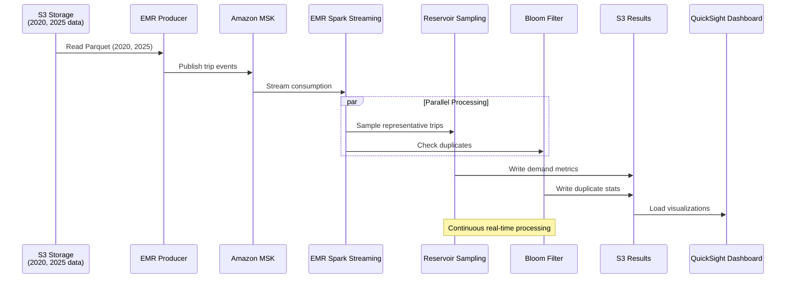

### 5.3 AWS Data Year Filtering Strategy

| Year | Records (Approx) | S3 Prefix Pattern | Use Case |
|------|------------------|-------------------|----------|
| **2020** | ~100M trips | s3://nyc-tlc/trip-data/yellow_tripdata_2020-*.parquet | Pre-pandemic + pandemic impact |
| **2025** | ~100M trips | s3://nyc-tlc/trip-data/yellow_tripdata_2025-*.parquet | Current year patterns |
| **Combined** | ~200M trips | Both prefixes | Temporal comparison analysis |

## 6. Algorithm Implementation Design

### 6.1 Reservoir Sampling Design

**Purpose:** Memory-efficient random sampling to maintain representative subset of streaming taxi trips

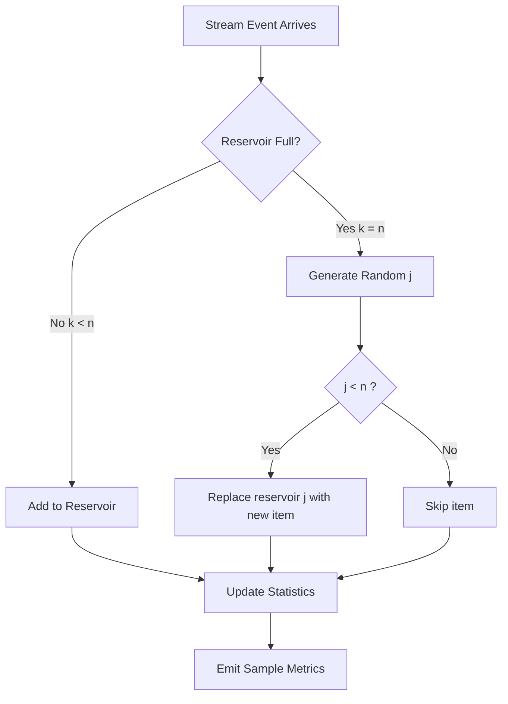

**Configuration Matrix:**

| Sample Size | Memory Usage | Accuracy | Use Case |
|-------------|--------------|----------|----------|
| 1,000 | ~100 KB | ±5% | Quick prototyping |
| 10,000 | ~1 MB | ±2% | Development testing |
| 100,000 | ~10 MB | ±0.5% | Production monitoring |
| 1,000,000 | ~100 MB | ±0.1% | High-precision analysis |

**Stratification Strategy:**

| Dimension | Strata | Purpose |
|-----------|--------|---------|
| **Temporal** | Hourly buckets (0-23) | Capture peak/off-peak patterns |
| **Spatial** | Borough-based (5 zones) | Geographic demand distribution |
| **Fare Tiers** | Low/Medium/High | Price sensitivity analysis |

### 6.2 Bloom Filter Design

**Purpose:** Fast duplicate detection across billions of trip records with minimal memory

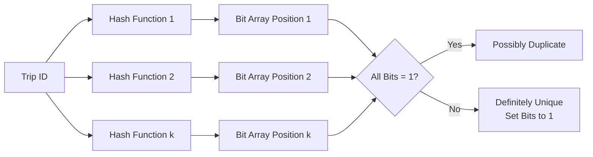

**Configuration Parameters:**

| Bit Array Size | Hash Functions | Expected Items | False Positive Rate | Memory |
|----------------|----------------|----------------|---------------------|--------|
| 1 MB | 3 | 100K | ~1% | 1 MB |
| 10 MB | 5 | 1M | ~0.1% | 10 MB |
| 100 MB | 7 | 10M | ~0.01% | 100 MB |
| 1 GB | 10 | 100M | ~0.001% | 1 GB |

**Hash Function Strategy:**

| Hash Type | Characteristics | Use Case |
|-----------|----------------|----------|
| **MurmurHash3** | Fast, good distribution | Primary hashing |
| **CityHash** | Optimized for strings | Trip ID hashing |
| **SHA-256** | High quality, slower | Critical deduplication |

## 7. Ground Truth Baseline Design

### 7.1 EMR MapReduce Ground Truth Pipeline

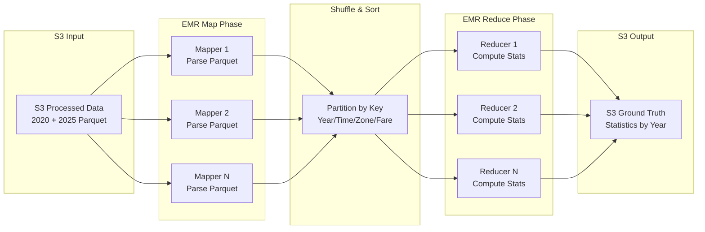

### 7.2 Ground Truth Metrics (Year-wise Comparison)

| Metric Category | Measurements | 2020 Baseline | 2025 Baseline |
|-----------------|--------------|---------------|---------------|
| **Trip Duration** | Mean, median, std dev, percentiles | Pandemic impact analysis | Current patterns |
| **Fare Distribution** | Mean, median, mode, variance | 2020 pricing baseline | 2025 pricing trends |
| **Temporal Patterns** | Hourly/daily/weekly aggregates | COVID-era demand | Post-pandemic demand |
| **Spatial Analytics** | Zone-wise demand, borough distribution | 2020 geographic patterns | 2025 hotspots |
| **Duplicate Count** | Exact duplicate trip_id count | 2020 data quality | 2025 data quality |
| **Year-over-Year** | Growth rates, pattern shifts | Comparative analysis | Trend identification |

## 8. Performance Evaluation Design

### 8.1 Accuracy Validation Framework (AWS)

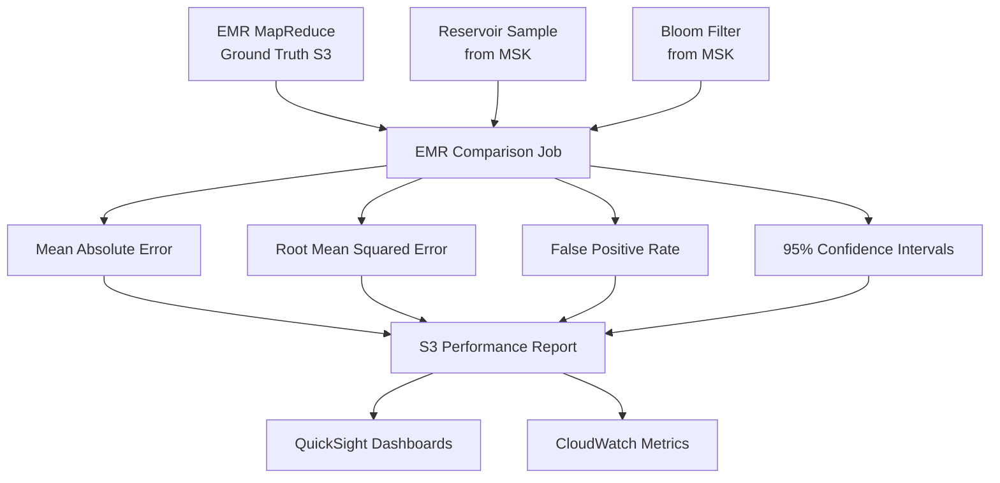

**Error Metrics:**

| Metric | Formula | Acceptable Threshold | Purpose |
|--------|---------|---------------------|---------|
| **MAE** | Σ\|predicted - actual\| / n | < 5% | Average deviation |
| **RMSE** | √(Σ(predicted - actual)² / n) | < 7% | Penalize large errors |
| **False Positive Rate** | FP / (FP + TN) | < 1% | Bloom filter accuracy |
| **Sample Bias** | \|sample_mean - population_mean\| | < 2% | Sampling quality |

### 8.2 AWS Performance Testing Matrix

| Test Category | Metrics | AWS Measurement Method |
|---------------|---------|------------------------|
| **Memory Efficiency** | Peak usage, allocation patterns | EMR JVM profiling, CloudWatch |
| **Throughput** | Records/second, events/minute | MSK metrics, Spark UI, CloudWatch |
| **Latency** | End-to-end processing time, p99 latency | CloudWatch Insights, X-Ray tracing |
| **Scalability** | Performance at 1M, 10M, 50M, 100M, 200M records | EMR auto-scaling testing |
| **Resource Utilization** | CPU, memory, network, disk I/O | CloudWatch, EMR metrics |
| **Cost Efficiency** | Processing cost per million records | AWS Cost Explorer |

### 8.3 AWS Bottleneck Analysis & Optimization

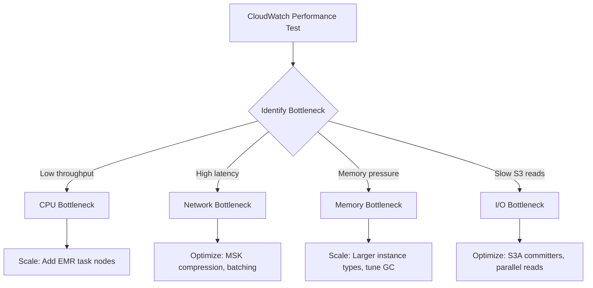

## 9. AWS Real-time Analytics Dashboard Design

### 9.1 QuickSight Dashboard Components

| Panel | Visualizations | Metrics Displayed | Data Source | Refresh |
|-------|---------------|-------------------|-------------|---------|
| **EMR Health** | Gauge charts, time series | CPU, memory, cluster status | CloudWatch | 1 minute |
| **MSK Performance** | Line charts | Throughput, consumer lag | MSK metrics | 1 minute |
| **Algorithm Accuracy** | Line charts, error bars | MAE, RMSE vs ground truth (2020 vs 2025) | S3 results | 5 minutes |
| **Geographic View** | Interactive NYC map, heatmap | Zone demand (2020 vs 2025) | S3 Athena query | 5 minutes |
| **Temporal Comparison** | Dual time-series | 2020 vs 2025 hourly demand | S3 Athena query | 5 minutes |
| **Fare Analytics** | Distribution plots, box plots | Fare trends (2020 vs 2025) | S3 Athena query | 5 minutes |
| **Duplicate Detection** | Counter widgets, pie charts | Bloom filter stats by year | S3 results | 5 minutes |

### 9.2 AWS Dashboard Architecture

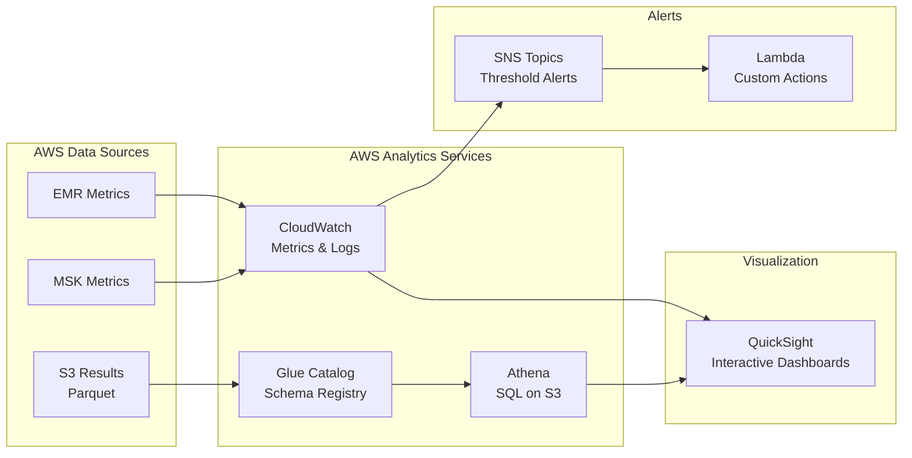

## 10. Data Validation Strategy

### 10.1 Multi-source Validation

| Validation Type | Check | Action on Failure |
|-----------------|-------|-------------------|
| **Schema Consistency** | Column names, data types match across TLC/S3/Azure | Log inconsistency, use TLC as primary |
| **Temporal Alignment** | Timestamp ranges match expected periods | Filter out-of-range records |
| **Referential Integrity** | Location IDs exist in zone lookup | Drop invalid trips, log count |
| **Data Completeness** | Required fields non-null | Impute or drop based on % missing |
| **Range Validation** | Fare > 0, distance > 0, passengers > 0 | Flag anomalies, apply filters |

### 10.2 AWS Data Cleaning Pipeline

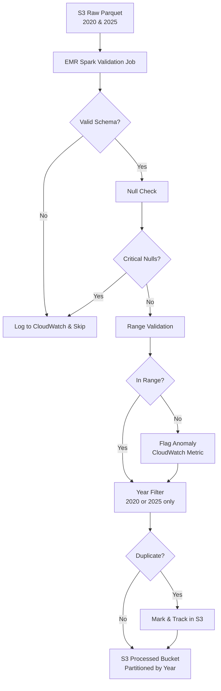

### 11.2 AWS Component Dependencies

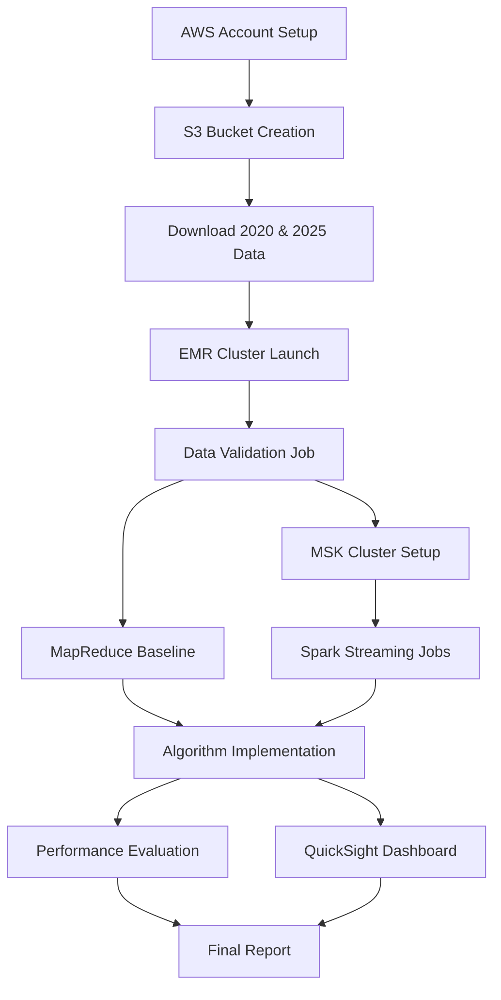
\